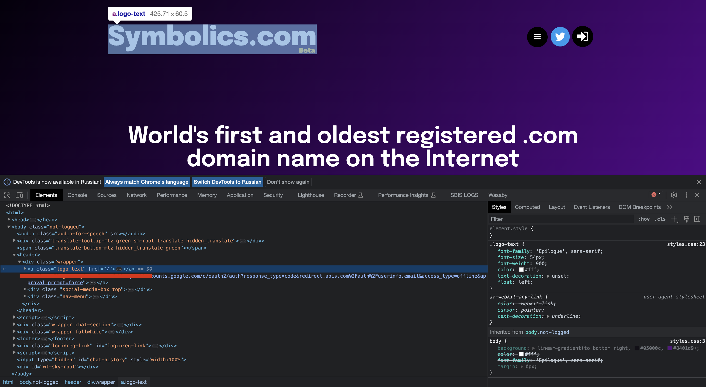

# Документация к фреймворку.

Данный фреймфорк позволяет автоматизировать тестирование веб-приложений.
Если говорить кратко то это обертка над selenium и pytest. Фреймворк призван
упростить процесс написания автотестов, так как позволяет описывать элементы
и взаимодействовать с ними более короткими командами. Более детально будет
описано ниже.
Настоятельно рекомендуется перед использованием фреймворка изучить как работают
голые [selenium](https://habr.com/ru/articles/248559/)
и [pytest](https://habr.com/ru/companies/otus/articles/580212/). <br>

### Глава 1. Взаимодействие с браузером.

На данным момент UATF позволяет работать с chrome браузером общаясь с ним
через chromedriver (актуальная версия [тут](https://googlechromelabs.github.io/chrome-for-testing/)).
Версию драйвера необходимо выбирать аналогичной версии браузера. Драйвер желательно положить
в папку с python.

При запуске автотеста UATF сам запускает браузер с необходимыми настройками,
которые подобраны для стабильной работы тестов. Доступные опции
описаны [тут](https://coderlessons.com/tutorials/kachestvo-programmnogo-obespecheniia/uchebnik-selenium/78-optsii-chrome-i-zhelaemye-vozmozhnosti).<br>
Методы для взаимодействия с браузером и их описания можно найти в файле [browser.py](UATF/ui/browser.py).

### Глава 2. Описание элементов страницы.

Написание тестов и описание элементов страниц должно придерживаться паттерна 
Page Object. Проще говоря Page Object - это шаблон проектирования кода,
когда все элементы страницы/компонентов страниц и методы для взаимодействия с ними описываются в 
отдельном классе. <br> 

ВАЖНО!!! НЕ НАДО ОПИСЫВАТЬ ЭЛЕЕНТЫ ВНУТРИ ФАЙЛА/ТЕЛА ТЕСТА

Для описания страницы необходимо создать класс и унаследовать его от базового класса
фреймворка Region (описан [тут](uatf/ui/region.py)).
Далее необходимо в докстринге класса указать его описание и принадлежность к странице/компоненту. <br>
```
from uatf import *
from uatf.ui import *


class MainPage(Region):
    """Главная страница github.com"""
```

После чего можно приступать к описанию элементов.

#### Поиск элементов

Для поиска элементов элементов внутри страницы UATF предлагает использовать следующие стратегии:

базовые стратегии (частые)
- By.CSS_SELECTOR
- By.CLASS_NAME

кастомные стратегии
- FindBy.DATA_QA
- FindBy.JQUERY
- FindBy.JAVASCRIPT

#### Описание элемента
Так же для описания элементов в UATF зашиты следующие инструменты:

- Element - возвращает первый найденный элемент по локатору (базовый, от него наследуются все последующие)
- CustomList - возвращает множество элементов с одинаковыми локаторами
- Button - для описания кнопок
- Link - для описания ссылок
- Text - для описания текстовых элементов
- TextField - для описания текстовых полей
- ElementList - группирует элементы для последовательного выполнения одинаковых действий

Описание элемента должно выглядеть следующим образом
```
from uatf import *
from uatf.ui import *


class MainPage(Region):
    """Главная страница symbolics.com"""
    
    logo = Element(how=By.CSS_SELECTOR, locator='logo-text', rus_name='Заголовок')
```
, где how - стратегия поиска элемента, locator - класс элемента, rus_name - русское название/описание элемента.


