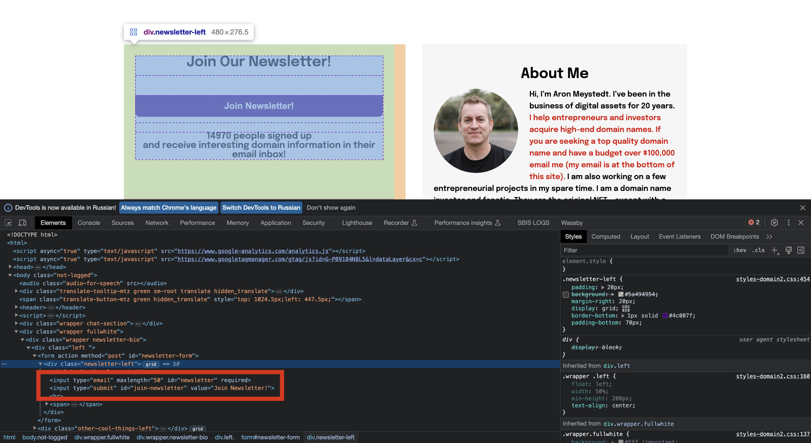

# Документация к фреймворку.

Данный фреймфорк позволяет автоматизировать тестирование веб-приложений.
Если говорить кратко то это обертка над selenium и pytest. Фреймворк призван
упростить процесс написания автотестов, так как позволяет описывать элементы
и взаимодействовать с ними более короткими командами. Более детально будет
описано ниже.
Настоятельно рекомендуется перед использованием фреймворка изучить как работают
голые [selenium](https://habr.com/ru/articles/248559/)
и [pytest](https://habr.com/ru/companies/otus/articles/580212/). <br>

### Глава 1. Взаимодействие с браузером.

На данным момент UATF позволяет работать с chrome браузером общаясь с ним
через chromedriver (актуальная версия [тут](https://googlechromelabs.github.io/chrome-for-testing/)).
Версию драйвера необходимо выбирать аналогичной версии браузера. Драйвер желательно положить
в папку с python.

При запуске автотеста UATF сам запускает браузер с необходимыми настройками,
которые подобраны для стабильной работы тестов. Доступные опции
описаны [тут](https://coderlessons.com/tutorials/kachestvo-programmnogo-obespecheniia/uchebnik-selenium/78-optsii-chrome-i-zhelaemye-vozmozhnosti).<br>
Методы для взаимодействия с браузером и их описания можно найти в файле [browser.py](UATF/ui/browser.py).

### Глава 2. Описание элементов страницы.

Написание тестов и описание элементов страниц должно придерживаться паттерна 
Page Object. Проще говоря Page Object - это шаблон проектирования кода,
когда все элементы страницы/компонентов страниц и методы для взаимодействия с ними описываются в 
отдельном классе. <br> 

**ВАЖНО!!! НЕ НАДО ОПИСЫВАТЬ ЭЛЕМЕНТЫ ВНУТРИ ФАЙЛА/ТЕЛА ТЕСТА**

Для описания страницы необходимо создать класс и унаследовать его от базового класса
фреймворка Region (описан [тут](uatf/ui/region.py)).
Далее необходимо в докстринге класса указать его описание и принадлежность к странице/компоненту. <br>
```python
from uatf import *
from uatf.ui import *


class MainPage(Region):
    """Главная страница github.com"""
```

После чего можно приступать к описанию элементов.

#### Поиск элементов

Для поиска элементов элементов внутри страницы UATF предлагает использовать следующие стратегии:

базовые стратегии (частые)
- By.CSS_SELECTOR
- By.CLASS_NAME

кастомные стратегии
- FindBy.DATA_QA
- FindBy.JQUERY
- FindBy.JAVASCRIPT

#### Описание элемента
Так же для описания элементов в UATF зашиты следующие инструменты:

- Element - возвращает первый найденный элемент по локатору (базовый, от него наследуются все последующие)
- CustomList - возвращает множество элементов с одинаковыми локаторами
- Button - для описания кнопок
- Link - для описания ссылок
- Text - для описания текстовых элементов
- TextField - для описания текстовых полей
- ElementList - группирует элементы для последовательного выполнения одинаковых действий

Описание элемента должно выглядеть следующим образом
```python
from uatf import *
from uatf.ui import *


class MainPage(Region):
    """Главная страница symbolics.com"""
    
    logo = Element(how=By.CSS_SELECTOR, locator='logo-text', rus_name='Логотип')
```
, где how - стратегия поиска элемента, locator - класс элемента, rus_name - русское название/описание элемента.


После описания элемента можно приступать к написанию метода, в котором происходит взаимодействие с ним.

**ВАЖНО!!! ЗАПРЕЩЕНО ОБРАЩАТЬСЯ К ЭЛЕМЕНТУ И ВЗАИМОДЕЙСТВОВАТЬ С НИМ ВНУТРИ ТЕЛА ТЕСТА**

Писать метод необходимо в том же классе в котором описан элемент _(Исключением является если класс 
наследуется не от Region, а от иного, в котором описаны общие элементы)_. При написании метода стоит придерживаться
следующих принципов:
- Указывать типы параметров, которые принимает на себя метод
- В докстринге описать что делает метод + расшифровать какие параметры он принимает
- Если метод открывает какую-либо панель описанную в другом классе, рекомендуется возвращать этот класс
через return

Допишем в наш класс элементы и методы взаимодействия с ними, которые позволяют оформить подписку:

```python
from uatf import *
from uatf.ui import *


class MainPage(Region):
    """Главная страница symbolics.com"""
    
    logo = Element(how=By.CSS_SELECTOR, locator='logo-text', rus_name='Логотип')
    email = TextField(how=By.CSS_SELECTOR, locator='[type="email"]', rus_name='Email')
    submit = Button(how=By.CSS_SELECTOR, locator='[type="submit"]', rus_name='Подписаться (join newsletter)')
    
    def open(self):
        """Открываем главную страницу"""
        
        self.browser.open('symbolics.com')
        self.logo.should_be(Disabled)
        
    def join_newsletter(self, email: str):
        """Оформляем подписку на новостные рассылки
        :param email: почта"""
        
        self.email.type_in(email)
        self.submit.click()
    
    def check_newsletter_hidden(self):
        """Проверяем что оформление подписки недоступно"""
        
        self.email.should_be(Hidden)
```



Доступные методы взаимодействия с элементами описаны [тут](uatf/ui/actions_chains.py).

### Глава 3. Инструменты проверки состояния элемента и браузера.

UATF позволяет несколько инструментов для проверки состояния элементов и браузера.

#### should_be()/should_not_be
    
Инструменты should_be()/should_not_be представляет из себя методы, которые принимают на себя следующие параметры:
- *conditions - разные матчеры (состояния)
- msg - сообщение, которое будет выводиться в случае ложной проверки
- wait_time - время ожидания результата (по умолчанию 5 сек)

Матчеры стоит выбирать в зависимости от потребностей. Вот несколько примеров:
- ContainsText - проверяет наличие частичного вхождения переданного текста с текстом внутри элемента
```self.caption.should_be(ContainsText('Symbolics'))```
- ExactText - проверяет точное совпадение переданного текста с текстом внутри элементы
```self.caption.should_be(ExactText('Symbolics.com'))```
- Displayed - проверяет что элемент отображается
```self.caption.should_be(Displayed)```
- Hidden - проверяет что элемент не отображается
```self.caption.should_be(Hidden)```

Для проверки состояния браузера необходимо обратиться к классу браузера:
```self.browser.should_be(UrlExact('https://symbolics.com/'))```

Все матчеры можно изучить [тут](uatf/ui/should_be.py)

#### assert_that()
Метод assert_that() позволяет проводить сравнения необходимых значений с эталоном или 
вхождения элементов в список.
Принимает следующие параметры:
- arg1 - первый аргумент сравнения (что сравниваем)
- arg2 - второй аргумент сравнения (с чем сравниваем)
- desc - текстовое описание ошибки
- wait_time - разрешено только передавать and_wait()/and_wait(5)

```assert_that(self.caption.text, equal_to('Symbolics.com'), 'Текст в логотипе не совпадает'')```

assert_that() прелестен тем, что способен вызывать в себе лямбда-функции, что позволяет проверять результат,
который ожидается после определенного действия.
Например мы кликаем по элементу и ожидаем что откроется новое окно, но это может произойти не сразу. В таком случае
можем воспользоваться следующей конструкцией

```assert_that(lambda: self.browser.count_windows, equal_to(2), 'Новое окно не открылось', and_wait(5))```

Данная проверка будет в течении 5 сек вызывать метод self.browser.count_windows и сравнивать его значение с эталоном,
в противном случаем тест упадет с сообщением переданным в desc.

Все методы проверок assert_that описаны [тут](uatf/assert_that.py)

P.S.

self.browser.should_be(CountWindows(2)) не то же самое что assert_that(lambda: self.browser.count_windows, equal_to(2), 'Новое окно не открылось', and_wait(5))
В первом случае мы получим результат вызова единожды, а во втором до тех пор пока результат не будет равен эталону в течении 5 сек.

!!!ВАЖНО. assert_that С lambda ФУНКЦИЕЙ НЕ БУДЕТ РАБОТАТЬ БЕЗ ПАРАМЕТРА and_wait()

### Глава 4. Написание автотестов.

Для написания автотеста необходимо создать py файл с названием следующего вида - test_[file_name].py
В файл импортируется uatf и uatf.ui.
После чего можно приступать с созданию тела теста.
Для грамотной работу автотеста и uatf тело теста должно состоять из следующих элементов:

```python
from uatf import *
from uatf.ui import *


class TestFirst(TestCaseUI):
    """Первый автотест проверяющий что-то."""

    @classmethod
    def setUpClass(cls):
        """Действия в setUpClass будет выполняться ЕДИНОЖДЫ ДО запуска теста."""
    
    def setUp(self):
        """Действия в setUp будут выполняться ДО запуска КАЖДОГО ПОСЛЕДУЮЩЕГО теста."""

    def test_01(self):
        """Первый тест проверяющий что-то.
        Сюда необходимо прописывать что проверяет тест"""

    def test_02(self):
        """Второй тест проверяющий что-то.
        Сюда необходимо прописывать что проверяет тест."""
    
    def tearDown(self):
        """Действия в tearDown будут выполняться ПОСЛЕ прохождения КАЖДОГО ПОСЛЕДУЮЩЕГО теста,
        несмотря на то тест прошел успешно или упал."""

    @classmethod
    def tearDownClass(cls):
        """Действия в tearDownClass будут выполняться ПОСЛЕ прохождения теста ЕДИНОЖДЫ,
        несмотря на то тест прошел успешно или упал."""
```

В setUpClass обычно помещается инициализация импортируемых классов. <br>
В setUp необходимые действия, которые будут происходить для каждого последующего теста до его старта. (Например открытие страницы)<br>
В test_01 помещаются все необходимые действия и проверки. <br>
В test_02 помещаются все необходимые действия и проверки. <br>
В tearDown необходимые действия, которые будут происходить для каждого последующего теста после его завершения. (Например перезагрузка страницы и закрытие всех вкладок)<br>
В tearDownClass необходимые действия, которые будут происходить после прохождения всех тестов. (Например чистка данных оставшихся от автотестов через апи)<br>


Используем ранее описанный класс для написани автотеста.

```python
import datetime
from uatf import *
from uatf.ui import *
from pages import MainPage  # импортируем описанный нами ранее класс главной страницы symbolics.com
from email.api import EmailApi  # представим что тут лежат апи методя для email ящика


class TestFirst(TestCaseUI):
    """Проверяем оформление подписки на новости"""

    @classmethod
    def setUpClass(cls):
        cls.main_page = MainPage(self.driver)
        cls.email_api = EmailApi()

    def setUp(self):
        self.main_page.open()

    def test_01(self):
        """Проверяем оформление подписки на новости"""

        log('Офомляем подписку на новости')
        self.main_page.join_newsletter('my_email@gmail.com')

        log('Проверяем что после оформления подписки поле с вводом email пропало')
        self.main_page.check_newsletter_hidden()

    def tearDown(self):
        self.browser.close_windows_and_alert()

    @classmethod
    def tearDownClass(cls):
        cls.email_api.delete_incoming_letter(day=datetime.date.today()) #очищаем наш ящик от писем за сегодняшний день
```

!!!ВАЖНО ПРИ ИНИЦИАЛИЗАЦИИ ПЕЙДЖЕЙ (КЛАССОВ ОПИСЫВАЮЩИХ СТРАНИЦЫ) НЕОБХОДИВО ПЕРЕДАВАТЬ DRIVER